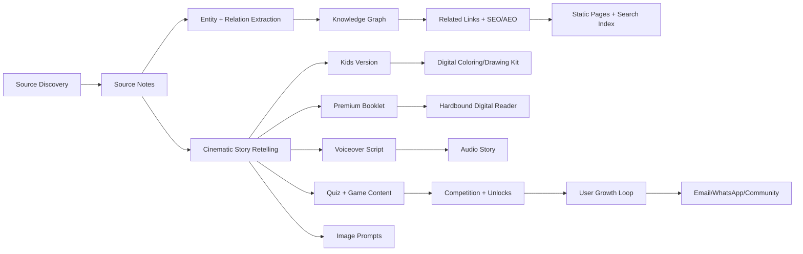

# Continuous Engine Architecture

## 1. Big Picture

This must become a living cultural engine, not a one-time content upload.

The engine has two sides:

1. **Knowledge/content engine**
   - source discovery,
   - source ingestion,
   - entity extraction,
   - story construction,
   - lightweight entity graph building,
   - image/art prompt generation,
   - audio/voiceover generation,
   - translation,
   - SEO/AEO packaging,
   - human review,
   - publishing.

2. **User/community engine**
   - signup,
   - quiz play,
   - drawing/coloring unlocks,
   - booklet reading,
   - story listening,
   - competitions,
   - referrals,
   - kit waitlists,
   - school/community leads,
   - lifecycle messaging.

The first engine creates trustworthy value. The second engine turns that value into repeat usage, community, and commerce.

## 2. Operating Loop

## 3. Content Production Stages

### Stage 1: Source Intake

Each source record must store:

- canonical title,
- tradition,
- language,
- translator/editor,
- publication/license status,
- URL or file location,
- section hierarchy,
- usage rights,
- extraction status,
- review status.

Source policy:

- Public domain: can be ingested and adapted.
- Permissioned: can be used according to permission.
- Open web but unclear license: cite and summarize; avoid full republication.
- Modern copyrighted books: do not rephrase into replacement content without rights.

### Stage 2: Story Candidate Extraction

From every source section, extract:

- story title,
- source location,
- characters,
- deities,
- places,
- objects,
- festivals,
- virtues,
- conflict,
- turning point,
- resolution,
- child-safe framing notes,
- sensitive topics,
- citations.

### Stage 3: Lightweight Entity Graph Builder

Do not overbuild the graph first. The first version should capture what publishing and search need:

- canonical names,
- aliases/spellings,
- people/deities/rishis,
- places/temples,
- texts/source sections,
- festivals,
- titles and relationships,
- related page links.

The goal is not graph elegance. The goal is fast content creation, internal linking, AEO clarity, and future-proofing.

Every story creates or links:

- nodes: deity/person/rishi/place/text/story/festival/temple/object/product/activity,
- edges: appears in, family of, associated with, teaches, takes place at, source for, inspires product.

Every edge should have:

- source reference,
- confidence,
- reviewer status.

### Stage 4: Storytelling Pack

Every approved story gets:

- factual summary,
- cinematic adult narrative,
- kid narrative,
- 40-word AEO answer,
- FAQ,
- title/meta/OG data,
- quiz,
- image prompts,
- audio voiceover script,
- booklet layout sections,
- drawing/coloring kit instructions,
- related links from KG.

### Stage 5: Publishing

Publish as:

- normal article page,
- premium booklet reader,
- audio story,
- quiz/game,
- coloring/drawing kit,
- KG entity links,
- lead capture CTA.

## 4. Digital Experience Types

### Normal Story Page

Purpose: SEO, AEO, trust, source transparency.

Sections:

- direct answer,
- story retelling,
- source trail,
- character map,
- place map,
- meaning,
- kids version,
- quiz CTA,
- booklet CTA,
- audio CTA,
- related stories,
- kit CTA if relevant.

### Premium Digital Booklet

Purpose: emotional experience, family reading, paid/unlocked product.

Visual style:

- same fonts as current site,
- hardbound cover simulation,
- gold-foiled title treatment,
- page-turn animation,
- warm ivory paper,
- dark green/maroon/indigo covers,
- ornamental but readable chapter openings,
- no cartoonish UI.

Features:

- cover,
- table of contents,
- chapter pages,
- full-page art,
- talapatra interludes,
- source note page,
- parent reflection page,
- download certificate/unlock prompt.

### Talapatra Digital Reader

Purpose: sacred-object feeling.

Use for:

- slokas,
- blessings,
- names and meanings,
- short wisdom lines.

Design:

- horizontal palm-leaf cards,
- Devanagari + transliteration + meaning,
- tiny icon,
- soft engraved texture,
- audio pronunciation button.

### Digital Drawing Kit

Purpose: kids creativity and unlock loop.

Modes:

- color existing line art,
- trace a deity/object,
- decorate a festival object,
- complete a scene,
- upload finished work.

Unlock logic:

- first 3 pages free,
- email unlock for next 5,
- referral unlock for premium pack,
- competition unlock during festivals,
- kit purchase unlocks full bundle.

### Audio Story

Purpose: screen-light family use and cinematic devotion.

Audio package:

- voiceover script,
- SSML pauses,
- pronunciation glossary,
- background music brief,
- sound cue notes,
- transcript,
- chapter markers.

## 5. Temple and Travel Content Engine

Khatakshetra should become useful for temple discovery, not only stories.

For every temple, create a living guide:

- temple name and aliases,
- deity,
- state/city/locality,
- exact address and map link,
- timings,
- special darshan/ritual timings,
- festival calendar,
- how to reach by air/rail/road/local transport,
- nearby places not to miss,
- food/restaurants/prasadam notes,
- stay options,
- accessibility notes,
- dress/ritual etiquette,
- story behind the temple,
- sthala purana,
- primary sources and official links,
- vlog/video summary,
- user tips and comments,
- last verified date.

Source policy:

- Prefer official temple websites, government tourism pages, temple boards, and verified local sources.
- Use Google Places/Maps data for practical fields like address, rating, opening hours, photos, business status, and review signals where API terms allow.
- Treat timings as volatile. Every temple page must display `last_verified_at` and a caution to check official sources before travel.
- Do not copy full third-party reviews. Summarize patterns and link/cite sources where permitted.

Temple pages should be state/city clustered:

- `/temples/tamil-nadu`
- `/temples/tamil-nadu/chennai`
- `/temples/tamil-nadu/chennai/kapaleeshwarar-temple`

This is a strong SEO moat because it combines practical travel intent with sacred story intent.

## 6. User Growth Engine

User actions:

- signup,
- choose language,
- choose child age band,
- unlock coloring pages,
- complete quiz,
- save booklet,
- listen to story,
- submit artwork,
- refer friend,
- join kit waitlist,
- join competition,
- ask question.

Lifecycle messaging:

- welcome email,
- story unlock email,
- quiz score email,
- festival campaign email,
- kit preorder email,
- referral reward email,
- school/community lead follow-up.

Recommended channels:

- email first,
- WhatsApp later after explicit opt-in,
- community after moderation workflows exist.

## 7. Backend Recommendation

Start with Supabase because the repo already has Supabase email capture and Vercel serverless.

Use Supabase for:

- users/profiles,
- leads,
- consent,
- quiz attempts,
- unlocks,
- referrals,
- submissions,
- content tables,
- lightweight entity nodes/edges,
- storage buckets for generated images/audio/booklets.
- temple profiles, verification history, user tips, comments, submissions, and moderation.

Use Vercel for:

- static pages,
- serverless capture APIs,
- scheduled ingestion jobs if needed,
- build/deploy previews.

Use object storage for:

- images,
- generated coloring pages,
- audio files,
- booklet PDFs/HTML exports,
- user submissions.

Use Postgres tables first for the lightweight entity graph:

- `kg_nodes`,
- `kg_edges`,
- `source_refs`,
- `story_sources`.

Move to Neo4j/Memgraph only after graph queries become a visible product feature.

## 8. Agentic Jobs

### Scheduled Jobs

- Weekly source discovery.
- Daily content queue processing.
- Daily entity consistency check.
- Weekly temple timing/source freshness check.
- Weekly SEO/AEO refresh.
- Festival calendar campaign generator.
- Monthly temple data enrichment.

### Event Jobs

- New story added -> extract entities.
- Story approved -> generate quiz/booklet/audio/image prompts.
- User signs up -> assign unlocks and journey.
- User completes quiz -> store score and recommend next story.
- User refers friend -> unlock content.

### Human Review Gates

Required before publishing:

- source rights check,
- factual/source review,
- cultural/devotional sensitivity review,
- child-safety review,
- SEO title/meta review,
- image review.

## 9. Internal Skills

We should create internal operating skills for consistent production:

1. `source-librarian`
   - validates sources, rights, citations, and source hierarchy.

2. `entity-linker`
   - extracts canonical names, aliases, places, texts, titles, and relationship trails.

3. `cinematic-reteller`
   - creates structured, movie-like narratives without losing source discipline.

4. `kids-adapter`
   - creates age-banded versions, activities, and parent prompts.

5. `seo-aeo-publisher`
   - creates page metadata, FAQ, schema, and internal links.

6. `digital-book-designer`
   - converts stories into premium booklet/talapatra/audio/drawing kit specs.

7. `community-growth-operator`
   - designs unlocks, competitions, referrals, email journeys, and kit CTAs.

8. `temple-guide-researcher`
   - builds state/city temple guides, timings, travel notes, local tips, ritual context, restaurants, and vlog summaries with freshness tracking.

9. `contextual-translator`
   - translates meaning, cultural context, names, idiom, and devotional tone instead of doing literal text conversion.

These can be documented as repo skills first. Later they can become actual Codex skills or automation prompts.

## 10. What We Should Build Next

1. Add Supabase schema.
2. Add content workflow status fields.
3. Add a static page generator from JSON.
4. Build story index, entity page, temple guide page, quiz page, and kit waitlist page.
5. Build one premium digital booklet prototype for `Dasharatha Meets Shani`.
6. Build one digital drawing kit prototype for Rama/Sita/Hanuman or Ganesha.
7. Add an audio script format and sample voiceover-ready file.

This creates the real system: research/source -> entity links -> story/temple guide -> image/audio/booklet/game -> user unlock -> growth.
